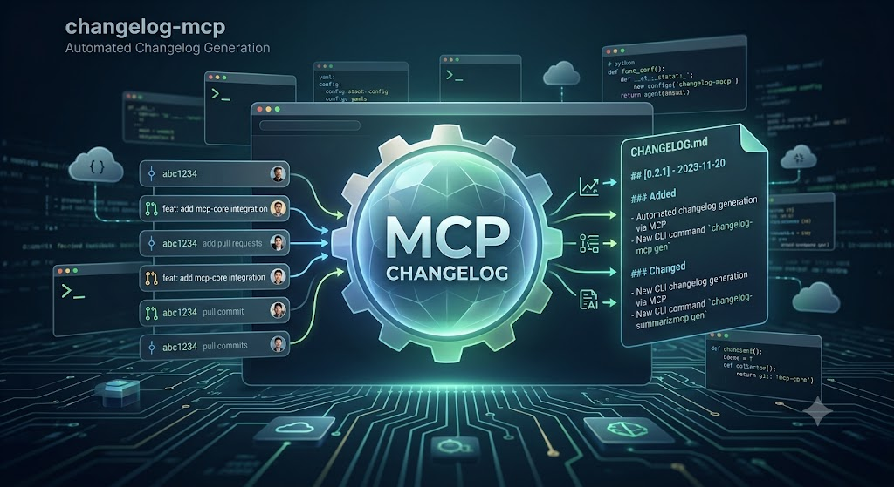

# changelog-mcp



[](https://github.com/smartsys/changelog-mcp/actions/workflows/ci.yml)
[](LICENSE)
[](pyproject.toml)

Ein universeller MCP-Server für das Changelog-Management. Er funktioniert mit allen MCP-fähigen KI-Assistenten, darunter Claude Code, Cursor, Windsurf, Cline und Claude Desktop.

## Das Problem

KI-Assistenten sind sehr gut darin, Changelog-Einträge zu formulieren, aber weniger zuverlässig beim Verwalten einer Changelog-Datei. Typische Probleme sind:

- vorhandene Einträge werden versehentlich überschrieben oder gelöscht,
- Versionsnummern werden falsch erhöht oder vergessen,
- das Format wird inkonsistent,
- Merge-Konflikte entstehen,
- im schlimmsten Fall wird die gesamte Changelog-Datei beschädigt.

Je größer ein Projekt wird und je häufiger KI Änderungen dokumentiert, desto höher wird dieses Risiko.

## Die Lösung

`changelog-mcp` nimmt der KI die Verwaltung der Changelog-Dateien vollständig ab.

Statt Markdown-Dateien direkt zu bearbeiten, schreibt die KI ausschließlich strukturierte Änderungsdatensätze in eine **JSONL-Datei**. Diese Datei ist die einzige Quelle der Wahrheit. Daraus erzeugt der Server anschließend deterministisch alle Markdown-Changelogs.

Der Server übernimmt dabei unter anderem:

- sicheres Hinzufügen neuer Einträge,
- automatische Versionsberechnung,
- konsistente Formatierung,
- Generierung von `CHANGELOG.md` und `CHANGELOG-full.md`,
- automatische Backups, bevor Dateien geändert werden.

Dadurch kann die KI sich auf den Inhalt konzentrieren, während der Server sicherstellt, dass die Changelog-Historie konsistent und nachvollziehbar bleibt.

> **Status:** Aktive Entwicklung. Die Basisversion (Server, Store und 15 Tools) ist funktionsfähig und über den `stdio`-Transport verifiziert.

## Features

- **15 MCP-Tools** (Setup, Erfassung, Release, Suche, Rendern, Migration) über stdio.
- **Drei Format-Presets:** `keep-a-changelog`, `conventional`, `smart`.
- **Einträge korrigierbar:** `edit_entry` / `delete_entry` ändern oder entfernen Einzeleinträge
  per ID; bereits veröffentlichte Einträge sind vor dem Löschen geschützt.
- **Strukturierte Suche** mit Freitext-Ranking und Filtern (Kategorie, Datei, Version, Zeitraum).
- **Migration** bestehender Changelogs (`import_records` + `verify_store`).
- **Versionierung** `semver` oder `patch-only`, konfigurierbarer Prefix.
- **Defense-in-Depth:** Zeilen-Validierung beim Lesen (defekte Zeilen werden gemeldet und
  übersprungen), Path-Traversal- und Symlink-Schutz, Größenlimit, Render-Schutz. Korrekturen
  laufen über angehängte Records statt über Mutation bestehender Zeilen, sodass die
  Rohhistorie in der JSONL-Datei nachvollziehbar bleibt.
- **Rotierendes Backup:** vor der ersten Änderung je Zeitraum (Default täglich) wird der Store
  gesichert; die letzten 30 Backups bleiben erhalten. Ordner, Intervall, Aufbewahrung und
  Dateiname-Muster sind konfigurierbar.
- **Zero-Config:** läuft ohne Konfigurationsdatei mit sinnvollen Defaults.

## Installation & Einbindung in den KI-Client

Der Server läuft als **stdio-MCP-Server** und wird über `uvx` gestartet — kein manuelles Environment
nötig (Voraussetzung: [`uv`](https://docs.astral.sh/uv/) ist installiert). Trage ihn in die
MCP-Konfiguration deines Clients ein. Bei Claude Code ist das die Datei `.mcp.json` im Projekt-Root
(im Repo liegt sie als Vorlage unter [`.mcp.json.example`](.mcp.json.example)):

```json
{
  "mcpServers": {
    "changelog": {
      "command": "uvx",
      "args": ["--from", "git+https://github.com/smartsys/changelog-mcp", "changelog-mcp"],
      "env": {
        "CHANGELOG_MCP_CONFIG": "./documentation/changelog/changelog-mcp-config.json"
      }
    }
  }
}
```

Feld für Feld:

- **`command` / `args`** — `uvx` holt den Server direkt aus diesem Repository und startet ihn; eine
  separate Installation entfällt.
- **`env.CHANGELOG_MCP_CONFIG`** — Pfad zu deiner Config-Datei, **relativ zum Projekt-Root** (der Pfad
  im Beispiel ist frei wählbar — leg die Datei ab, wo es zu deinem Projekt passt, siehe
  [Konfiguration](#konfiguration)). Ohne diese Variable startet der Server im **Zero-Config-Modus** mit
  Defaults.

Nach dem Eintragen den Client neu starten; die Changelog-Tools stehen dann zur Verfügung.

> **Geplant:** Veröffentlichung auf PyPI, danach genügt `"args": ["changelog-mcp"]` (ohne `--from`).

### Erster Start: einmal `init_changelog`

`uvx` installiert nur den **Server** (das Paket). **Keine** Config und **kein** Store werden
mitgeliefert — beide gehören in dein Projekt. Nach dem Eintragen der `.mcp.json` rufst du daher
**einmal** das Tool `init_changelog` auf (z.B. „Initialisiere den Changelog"). Es legt an, was fehlt:

- den **Store** (`changelog.jsonl`, die Quelle der Wahrheit),
- die **Config** — und zwar genau am Pfad aus `CHANGELOG_MCP_CONFIG` (bzw., ohne die Variable,
  `changelog-mcp-config.json` im Projekt-Root).

`init_changelog` ist **idempotent**: Ein zweiter Aufruf überschreibt nichts — ein vorhandener Store
und eine vorhandene Config bleiben unangetastet. Ohne diesen Aufruf laufen die Tools im
Zero-Config-Modus (Defaults), aber ohne Config-Datei, die du bearbeiten kannst.

### Pro Projekt einrichten

Der Server ist ein **einmal installiertes Werkzeug**, aber ein Changelog gehört immer zu **genau
einem Projekt** — es gibt keinen globalen Changelog. Config, Store und `.mcp.json` werden relativ
zum jeweiligen Projekt-Root aufgelöst. Richte den Server deshalb in **jedem** Projekt separat ein:
`.mcp.json` eintragen und einmal `init_changelog` ausführen.

## Konfiguration

Der Server läuft **ohne Konfigurationsdatei** (Zero-Config) mit sinnvollen Defaults. Der einfachste
Weg zu einer eigenen, bearbeitbaren Config ist `init_changelog` (siehe
[Erster Start](#erster-start-einmal-init_changelog)) — es schreibt die Datei mit allen Default-Werten
an den Pfad aus `CHANGELOG_MCP_CONFIG`. Danach passt du dort an, was du brauchst.

**Alle Felder sind optional.** Was du weglässt, bleibt auf dem Default. Eine vollständige Datei mit
den Standardwerten sieht so aus:

```json
{
  "format": "smart",
  "store":        { "file": "changelog.jsonl", "path": "./documentation/changelog" },
  "changelog":    { "file": "CHANGELOG.md", "path": "./", "encoding": "utf-8", "entrySpacing": 2, "includePrivate": false },
  "fullChangelog":{ "enabled": true, "file": "CHANGELOG-full.md", "path": "./documentation/changelog", "includePrivate": false },
  "versioning":   { "mode": "semver", "prefix": "", "fixedMajor": null, "fixedMinor": null },
  "backup":       { "enabled": true, "path": "./documentation/changelog/backup", "interval": "daily", "retention": 30, "fileFormat": "changelog-{date}.jsonl" },
  "dateFormat": "YYYY-MM-DD",
  "language": "de"
}
```

Alle Pfade sind **relativ zum Projekt-Root**. Der Server prüft sie streng (kein `..`, keine
Symlinks aus dem Projekt heraus). Die aktuell aktive, aufgelöste Konfiguration kannst du jederzeit
mit dem Tool `get_config` ausgeben lassen.

### Die Blöcke im Überblick

| Block | Zweck | Details |
|---|---|---|
| `format` | Kategorien-Regeln + Aussehen der Versions-Überschrift | [Format-Presets](#format-presets) |
| `store` | Ort der JSONL-Quelle der Wahrheit | unten |
| `changelog` | die kuratierte `CHANGELOG.md` | unten |
| `fullChangelog` | die detaillierte `CHANGELOG-full.md` | unten |
| `versioning` | wie Versionsnummern vergeben werden | [Versionierung](#versionierung) |
| `backup` | automatische Sicherung des Stores | [Backups](#backups) |
| `dateFormat` / `language` | Datumsformat und Sprach-Metadatum | unten |
| `includePrivate` | private Einträge doch publizieren | [Private Einträge](#private-einträge) |

**`store`** — legt fest, wo die JSONL-Datei liegt, aus der alles generiert wird:

- `file` — Dateiname (Default `changelog.jsonl`).
- `path` — Ordner relativ zum Projekt-Root (Default `./documentation/changelog`).

**`changelog`** — die kuratierte, öffentliche `CHANGELOG.md` (nur Release-Zusammenfassungen):

- `file` / `path` — Name und Ort der Datei (Default `CHANGELOG.md` im Projekt-Root).
- `encoding` — Textkodierung der **beiden** Markdown-Dateien: `utf-8` \| `utf-16le` \| `latin1` \|
  `ascii` (Default `utf-8`). Der Store selbst ist immer UTF-8.
- `entrySpacing` — Anzahl Leerzeilen zwischen zwei Versionsblöcken (≥ 0, Default 2).
- `includePrivate` — siehe [Private Einträge](#private-einträge).

**`fullChangelog`** — die detaillierte `CHANGELOG-full.md` mit **jedem** Einzeleintrag:

- `enabled` — `false` schaltet diese Datei komplett ab (Default `true`).
- `file` / `path` — Name und Ort (Default `CHANGELOG-full.md`).
- `includePrivate` — siehe [Private Einträge](#private-einträge).

**`dateFormat`** — Datumsformat der Einträge und Überschriften über die Tokens `YYYY`, `MM`, `DD`.
Beispiele: `YYYY-MM-DD` → `2026-07-19`, `DD.MM.YYYY` → `19.07.2026`.

**`language`** — reines Metadatum (Default `en`). Wird derzeit **nicht** ausgewertet und ändert
nichts am Verhalten; die Sprache der Ausgaben liegt an deiner Nutzung, nicht an diesem Feld.

## Format-Presets

Das Feld `format` bestimmt, **welche Kategorien erlaubt sind** und **wie die Versions-Überschriften**
in `CHANGELOG.md` / `CHANGELOG-full.md` aussehen. Drei Presets stehen zur Wahl:

### `smart` (Default)

Flexibles Preset mit **frei wählbaren Kategorien** — du legst die Kategorien selbst fest.

- **Kategorien (frei, keine Validierung):** beliebig. Empfohlen als Vorschlagsliste:
  `Added` · `Changed` · `Deprecated` · `Removed` · `Fixed` · `Security` · `Documentation`
- **Versions-Überschrift:** `## [1.2.3] - 2026-07-19`
- Geeignet, wenn ein Projekt eigene Kategorien braucht, die keiner der strikten Presets abdeckt.

### `keep-a-changelog`

Der verbreitete Standard nach [keepachangelog.com](https://keepachangelog.com/de/1.1.0/).

- **Kategorien (strikt validiert):** `Added` · `Changed` · `Deprecated` · `Removed` · `Fixed` · `Security`
- **Versions-Überschrift:** `## [1.2.3] - 2026-07-19`
- Nur diese sechs Kategorien sind zulässig; jede andere wird mit einer Fehlermeldung abgelehnt.

### `conventional`

Angelehnt an [Conventional Commits](https://www.conventionalcommits.org/).

- **Kategorien (strikt validiert):** `Features` · `Bug Fixes` · `Performance` · `Reverts` · `Breaking Changes`
- **Versions-Überschrift:** `## 1.2.3 (2026-07-19)`
- Ebenfalls streng: nur die genannten Kategorien sind erlaubt.

## Versionierung

Der Block `versioning` steuert, **wie die Versionsnummern vergeben werden**. Wichtig zu verstehen:
in diesem Server bekommt **jeder einzelne `add_entry` eine eigene Versionsnummer** — die Version
zählt also pro Änderung hoch, nicht erst beim Release. Ein Release bündelt anschließend die Spanne
der Einträge unter der höchsten Versionsnummer dieser Spanne.

### `mode: "semver"` (Default)

Klassisches [Semantic Versioning](https://semver.org/lang/de/) mit den drei Stellen
`MAJOR.MINOR.PATCH`. Beim `add_entry` (und `get_next_version`) bestimmt der Parameter `bump`, welche
Stelle steigt:

- `bump: "patch"` (Default) — `1.2.3` → `1.2.4` (Fehlerbehebungen, Kleinigkeiten).
- `bump: "minor"` — `1.2.3` → `1.3.0` (neue, abwärtskompatible Funktionen).
- `bump: "major"` — `1.2.3` → `2.0.0` (Breaking Changes).

Bei leerem Store ist die **Initialversion** `0.1.0` (bzw. `fixedMajor.fixedMinor.0`, falls gesetzt).

Beispielkette: Start `0.1.0` → `add_entry(bump=patch)` → `0.1.1` → `add_entry(bump=minor)` →
`0.2.0` → `add_entry(bump=major)` → `1.0.0`.

### `mode: "patch-only"`

Major und Minor sind **fest verdrahtet**, nur die Patch-Stelle zählt fortlaufend hoch. Der Parameter
`bump` wird in diesem Modus **ignoriert**. Gedacht für Projekte, die einfach eine durchlaufende
Nummer wollen (z.B. eine Firmware- oder Doku-Reihe `1.4.x`).

- Die feste Basis kommt aus `fixedMajor` / `fixedMinor` (Default `0` / `1`, also Basis `0.1`).
- Beispiel mit `fixedMajor: 1`, `fixedMinor: 4`: `1.4.1` → `1.4.2` → `1.4.3` → …
- Änderst du die Basis später (z.B. auf `fixedMinor: 5`), springt der nächste Eintrag auf `1.5.1`.

### `prefix`

Reiner **Anzeige-Prefix** vor der Nummer in den Überschriften, üblich ist `"v"`. Aus `1.2.3` wird
dann z.B. `## [v1.2.3] - 2026-07-19`. Der Store speichert weiterhin die nackte Nummer; der Prefix
betrifft nur die Darstellung (Default leer, also kein Prefix).

### `fixedMajor` / `fixedMinor`

- Im Modus `semver`: setzen Major/Minor der **Initialversion** bei leerem Store (Default `null` →
  `0.1.0`).
- Im Modus `patch-only`: die **feste Basis**, gegen die die Patch-Nummer läuft (Default `0.1`).

## Private Einträge

Ein Eintrag kann per `add_entry(..., private=true)` als privat markiert werden — für Änderungen an
nicht-öffentlicher Doku, die trotzdem im Store nachvollziehbar bleiben soll. Standardmäßig erscheinen
private Einträge **weder** in `CHANGELOG.md` **noch** in `CHANGELOG-full.md`. Zwei Flags (Default
jeweils `false`) heben das gezielt auf:

- **`changelog.includePrivate`** — private Einträge fließen in den kuratierten `CHANGELOG.md`-Summary
  ein (`list_unreleased` zeigt sie dann ebenfalls).
- **`fullChangelog.includePrivate`** — private Einträge werden in `CHANGELOG-full.md` gerendert.

Bei `false` blendet `list_unreleased` private Einträge aus, damit sie gar nicht erst in den
öffentlichen Summary geraten. `create_release` bündelt sie dennoch (sie gelten als released); ein
Release nur aus privaten Einträgen erzeugt keinen öffentlichen Block.

## Backups

Der Server sichert den Store automatisch, bevor er im jeweiligen Zeitraum zum ersten Mal geändert
wird — als Sicherheitsnetz für den Fall, dass Einträge versehentlich geändert oder getilgt
werden. Ausgelöst wird beim ersten schreibenden
Tool-Aufruf (kein Scheduler nötig).

- **`enabled`** — Backups an/aus (Default `true`).
- **`path`** — Zielordner, relativ zum Projekt-Root (Default `./documentation/changelog/backup`).
- **`interval`** — `daily` \| `weekly` \| `monthly`: ein Backup pro Zeitraum (Default `daily`).
- **`retention`** — Anzahl behaltener Backup-Dateien; ältere werden entfernt (Default `30`).
- **`fileFormat`** — Dateiname-Muster; `{date}` wird zur Zeitraum-Kennung (`YYYY-MM-DD`,
  `YYYY-Www`, `YYYY-MM`).

## Beispiel-Konfigurationen

**Minimal — nur ein anderes Format, sonst alle Defaults:**

```json
{ "format": "keep-a-changelog" }
```

**Interne Doku — private Einträge im Detail-Changelog sichtbar, in der öffentlichen aber nicht:**

```json
{
  "format": "smart",
  "changelog":    { "includePrivate": false },
  "fullChangelog":{ "enabled": true, "includePrivate": true }
}
```

**Fortlaufende Patch-Reihe mit `v`-Prefix (z.B. Firmware `1.4.x`):**

```json
{
  "format": "smart",
  "versioning": { "mode": "patch-only", "prefix": "v", "fixedMajor": 1, "fixedMinor": 4 }
}
```

Ergebnis: Überschriften wie `## [v1.4.1] - 2026-07-19`, mit jedem Eintrag `v1.4.2`, `v1.4.3`, …

## Tools

Der Server stellt **15 MCP-Tools** bereit. Alle Parameter werden an der Tool-Grenze mit Pydantic
validiert; Fehlermeldungen sind deutsch und folgen dem Muster Beschreibung + Kontext + Lösung.

### Setup & Version

| Tool | Parameter | Beschreibung |
|---|---|---|
| `init_changelog` | `format?` (`keep-a-changelog` \| `conventional` \| `smart`) | Bootstrap: legt Store und Config-Datei an, was fehlt (Config am Pfad aus `CHANGELOG_MCP_CONFIG`). Idempotent — vorhandener Store/Config bleiben unangetastet. Die Markdown-Dateien entstehen erst beim ersten Release. |
| `get_current_version` | — | Höchste Version im Store plus Anzahl unveröffentlichter Einträge. |
| `get_next_version` | `bump?` (`major` \| `minor` \| `patch`, Default `patch`) | Berechnet die nächste Version aus der höchsten Store-Version und dem Bump-Modus. |
| `get_config` | — | Zeigt die aktive, aufgelöste Konfiguration als JSON inklusive Herkunft der Werte. |

### Laufende Erfassung

| Tool | Parameter | Beschreibung |
|---|---|---|
| `add_entry` | `category`, `description`, `details?` (Liste), `files?` (Liste), `bump?` (Default `patch`), `private?` (Default `false`) | Hängt einen validierten Einzeleintrag an den Store an. `private=true` hält ihn aus den publizierten Changelogs (siehe Abschnitt „Private Einträge"). |
| `edit_entry` | `id`, `category?`, `description?`, `details?` (Liste), `files?` (Liste) | Ändert Felder eines Eintrags per ID — nur die genannten Felder, Version und Datum bleiben. Intern als Korrektur-Record angehängt; der Read-Layer rechnet die Änderung ein. IDs liefern `list_unreleased` / `search_entries`. |
| `delete_entry` | `id` | Löscht einen **unveröffentlichten** Eintrag per ID (Tilgungs-Record); er entfällt in allen Ausgaben. Bereits released Einträge sind publizierte Historie und werden abgelehnt. |

### Veröffentlichen

| Tool | Parameter | Beschreibung |
|---|---|---|
| `list_unreleased` | — | Zeigt die öffentlichen Einträge seit dem letzten Release und die künftige Release-Version; private Einträge sind ausgeblendet, solange `changelog.includePrivate=false`. |
| `preview_release` | `summary` (Liste von Sections) | Rendert den Release-Block wie `create_release`, **ohne** zu schreiben (Trockenlauf). |
| `create_release` | `summary?` (Liste von Sections) | Bündelt **alle** unveröffentlichten Einträge (auch private) zu einem Release und rendert beide Markdown-Dateien neu. `summary` beschreibt nur den öffentlichen Block; bei einem reinen Privat-Release darf er leer bleiben. |

### Suche & Abruf

| Tool | Parameter | Beschreibung |
|---|---|---|
| `search_entries` | `query?`, `category?`, `file?`, `version?`, `released?`, `dateFrom?`, `dateTo?`, `limit?` (Default 10) | Durchsucht den strukturierten Store mit Freitext-Ranking; alle Filter werden UND-kombiniert. |
| `get_release` | `version` | Zeigt einen Release mit Zusammenfassung und allen gebündelten Einzeleinträgen. |

### Rendern & Migration

| Tool | Parameter | Beschreibung |
|---|---|---|
| `render_changelog` | — | Erzeugt beide Markdown-Dateien neu aus dem Store (idempotent, mit Render-Schutz). |
| `import_records` | `entries` (Liste), `releases?` (Liste) | Migration: hängt geparste Einträge und optional Releases an den Store an. |
| `verify_store` | `sourceFile` | Vergleicht die Versions-Überschriften einer Quelldatei mit dem Store und meldet Fehlendes. |

## Lizenz

[MIT](LICENSE)
